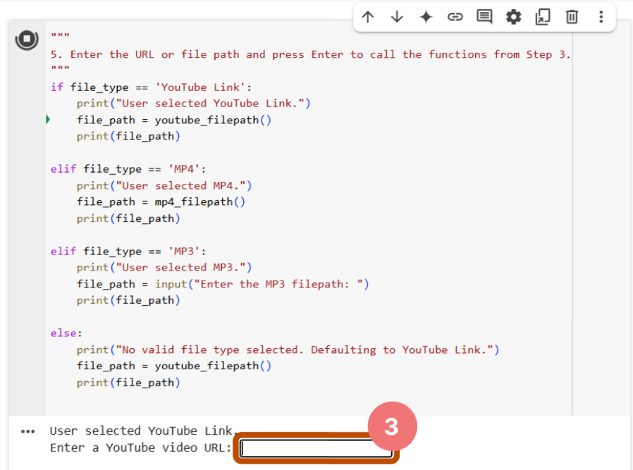
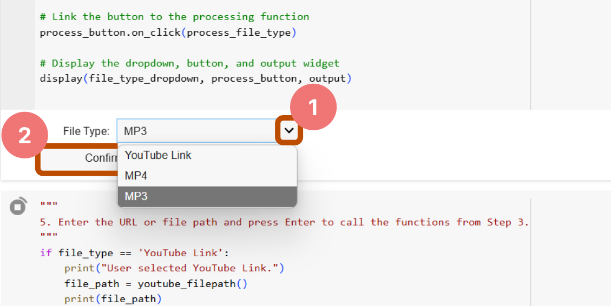

# Whisper on Google Colaboratory

Easily transcribe YouTube videos, MP4, and MP3 files to text using Whisper on Google Colab.

## Features
- No local setup required — runs entirely on Google Colab
- Supports YouTube URLs, MP4, and MP3 files
- Outputs transcribed text in `.txt` format

## Table of Contents
1. [Basic Setup](#i-basic-setup)
2. [Choose Data Type & Download Transcribed Text](#ii-choose-data-type--download-transcribed-text)
   - [YouTube Video ➔ Text File](#1-youtube-video--text-file)
   - [MP4 ➔ Text File](#2-mp4--text-file)
   - [MP3 ➔ Text File](#3-mp3--text-file)

### I. Basic Setup
1. Search for `google colab` on Google and press Enter.
2. Select the first search result or directly click this link: [Google Colaboratory](https://colab.research.google.com).
    
3. On the Colaboratory page, click the `File` option at the top left.
4. From the dropdown menu, select `Upload Notebook`.
    
5. Drag and drop `Whisper.ipynb` into the `Open a notebook` page.
    
6. After uploading, click the `Runtime` option at the top.
7. From the dropdown, select `Change runtime type`.
    
8. In the pop-up window, choose `Python 3` (this should be the default).
9. Set the hardware accelerator to `T4 GPU` (default is usually CPU).
10. Click the `Save` button at the bottom left.
    
11. Click the `Runtime` menu again.
12. Select `Run all` (or press `Ctrl + F9`) or **manually run code blocks 1 through 4 to avoid errors**.
   
   > [!NOTE]  
   > It’s normal to see errors at this point if you decided to `Run all`, since no file type or file path has been selected yet.
    

### II. Choose Data Type & Download Transcribed Text

#### 1. YouTube Video ➔ Text File
1. Select **YouTube** from the dropdown menu.
2. Click the `Confirm` button.
    
    - Example selection:
        
3. Run **Code Block 5** and paste the **YouTube video URL** when prompted. Press Enter and wait for the transcription.
    
4. Run **Code Block 6** and wait until it outputs `Your Transcript is here: YOUR_FILE_NAME.mp3.txt`.
5. In the right panel, click `Refresh` if the `.txt` file isn't visible.
6. Right-click on `YOUR_FILE_NAME.mp3.txt`.
7. Click `Download` to get your text file.
    
    

#### 2. MP4 ➔ Text File
1. Select **MP4** from the dropdown.
2. Click the `Confirm` button.
    
    - Example of selected result:
        
3. Drag and drop `<YOUR_FILE_NAME>.mp4` into the **Files** panel.
> [!TIP]  
> Click the **Files** icon on the right if the panel isn't open.
4. Right-click on the file.
5. Select `Copy path`.
6. Run **Code Block 5** and paste the **file path** into the input prompt. Press Enter to start conversion.
    
7. Run **Code Block 6** and wait for the message: `Your Transcript is here: YOUR_FILE_NAME.mp3.txt`.
8. Click `Refresh` (skip if the TXT file already appears).
9. Then, right-click on `YOUR_FILE_NAME.mp3.txt`.
10. Click `Download` to get your text file.
    
    

#### 3. MP3 ➔ Text File
1. Select **MP3** from the dropdown menu.
2. Click the `Confirm` button.
    
    - Screenshot of selected result:
        
3. Drag and drop `<YOUR_FILE_NAME>.mp3` into the **Files** panel.
> [!TIP]  
> Click the **Files** icon on the right if the panel isn't open.
4. Right-click on the file.
5. And select `Copy path`.
6. Run **Code Block 5** and paste the **file path** into the input textbar.
    
7. Run **Code Block 6** and wait for the message: `Your Transcript is here: YOUR_FILE_NAME.mp3.txt`.
8. Click `Refresh` (if needed).
9. Then, right-click on `YOUR_FILE_NAME.mp3.txt`.
10. Finally, click `Download` to get your text file.
    
    

## Notes
- Ensure stable internet connectivity for smooth transcription.
- For large files, transcriptions may take longer.
- If you encounter errors, try restarting the runtime (`Runtime` > `Restart runtime`).

Happy Transcribing!
