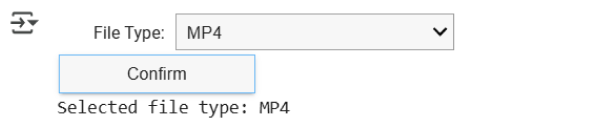

# How to Use Whisper on Google Colaboratory

### I. Basic Setup
1. Search for `google colab` on Google and press Enter.
2. Select the first search result or directly click this link: [Google Colaboratory](https://colab.research.google.com).
    
3. On the Colaboratory page, click the `File` option at the top left.
4. From the dropdown menu, select `Upload Notebook`.
    
5. Drag and drop `Whisper.ipynb` into the `Open a notebook` page.
    
6. After uploading, click the `Runtime` option at the top.
7. From the dropdown, select `Change runtime type`.
    
8. In the pop-up window, choose `Python 3` (this should be the default).
9. Set the hardware accelerator to `T4 GPU` (default is usually CPU).
10. Click the `Save` button at the bottom left.
    
11. Click the `Runtime` menu again.
12. Select `Run all` (or press `Ctrl + F9`) or manually run code blocks 1 through 4 to avoid errors.

    > [!NOTE]  
    > It’s normal to see errors at this point if you decided to `Run all`, since no file type or file path has been selected yet.

    

### II. Choose Data Type & Download Transcribed Text

#### 1. YouTube Video ➔ Text File
1. Use the dropdown menu to select the data type you want to transcribe.
2. Click the `Confirm` button.
    
    - Example of selected result:
        
3. Run code block 5 and input the `YouTube video URL` in the prompt. Press Enter and wait for the transcription.
    
4. Run code block 6 and wait until it outputs `Your Transcript is here: YOUR_FILE_NAME.mp3.txt`.
5. Click the `Refresh` button (skip if the TXT file already appears in the right panel).
6. Right-click on `YOUR_FILE_NAME.mp3.txt`.
7. Click `Download` to get your text file.
    
    

#### 2. MP4 ➔ Text File
1. Use the dropdown menu to select the data type.
2. Click the `Confirm` button.
    
    - Example of selected result:
        
3. Drag and drop `<YOUR_FILE_NAME>.mp4` into the `Files` panel.
    > [!NOTE]  
    > If the panel doesn’t open automatically, click the `Files` icon on the right (orange highlight below).
4. Right-click on the file.
5. Select `Copy path`.
6. Run code block 5 and paste the `file path` into the input prompt (use `Ctrl+V`). Press Enter to start conversion.
    
7. Run code block 6 and wait for the message `Your Transcript is here: YOUR_FILE_NAME.mp3.txt`.
8. Click `Refresh` (skip if the TXT file already appears).
9. Right-click on `YOUR_FILE_NAME.mp3.txt`.
10. Click `Download` to get your text file.
    
    

#### 3. MP3 ➔ Text File
1. Use the dropdown menu to select the data type.
2. Click the `Confirm` button.
    
    - Example of selected result:
        
3. Drag and drop `<YOUR_FILE_NAME>.mp3` into the `Files` panel.
    > [!NOTE]  
    > If the panel doesn’t open automatically, click the `Files` icon on the right (orange highlight below).
4. Right-click on the file.
5. Select `Copy path`.
6. Run code block 5 and paste the `file path` into the input prompt (use `Ctrl+V`).
    
7. Run code block 6 and wait for the message `Your Transcript is here: YOUR_FILE_NAME.mp3.txt`.
8. Click `Refresh`.
9. Right-click on `YOUR_FILE_NAME.mp3.txt`.
10. Click `Download` to get your text file.
    
    

